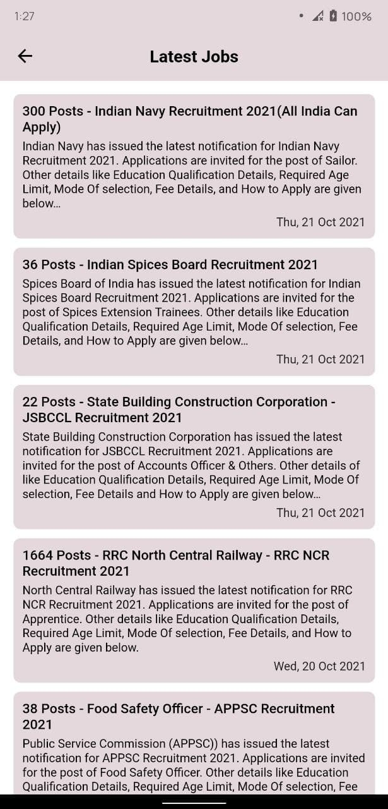
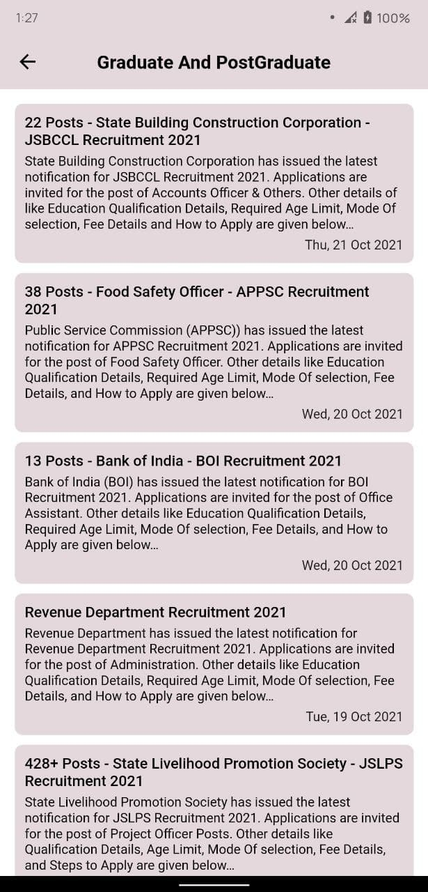
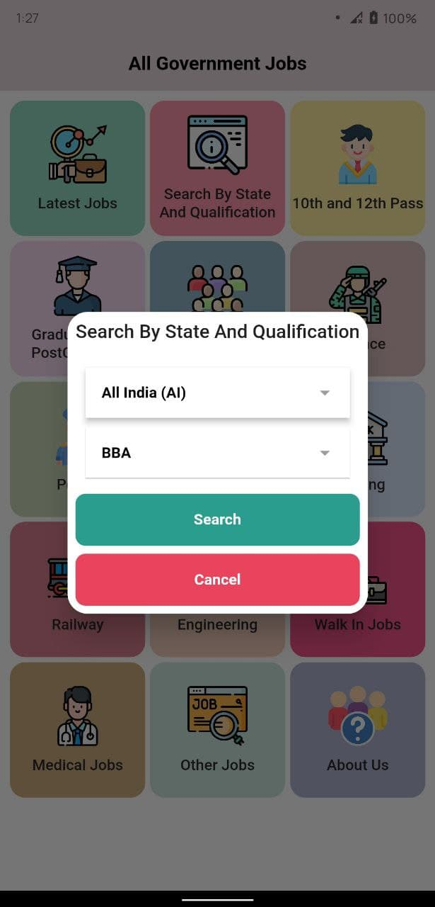
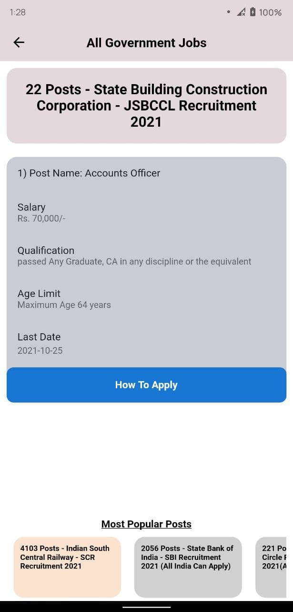

# all_govt_jobs

An app to get information about all government jobs of any categories in india only.
Used GetX package for everything. state management, snackbars, dialogs everything.

[Click to download apk](https://github.com/ashishpipaliya/all_government_jobs/raw/main/All%20Government%20Jobs.apk)

## Preview

|    |    |   |
|    |    |   |

## Content

GetX for state management
Dio for network requests

## Getting Started With Flutter

This project is a starting point for a Flutter application.

A few resources to get you started if this is your first Flutter project:

- [Lab: Write your first Flutter app](https://flutter.dev/docs/get-started/codelab)
- [Cookbook: Useful Flutter samples](https://flutter.dev/docs/cookbook)

For help getting started with Flutter, view our
[online documentation](https://flutter.dev/docs), which offers tutorials,
samples, guidance on mobile development, and a full API reference.
